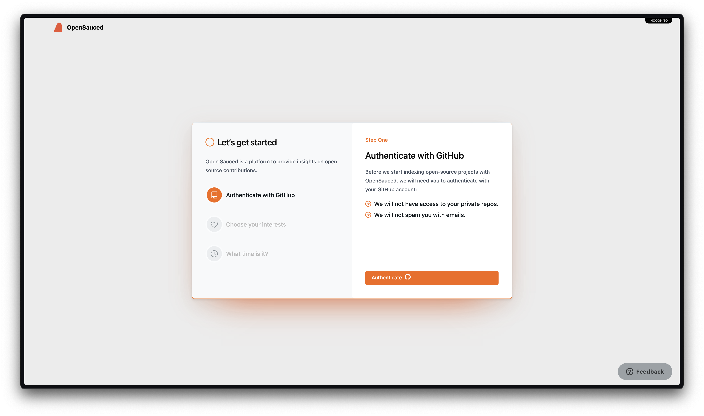
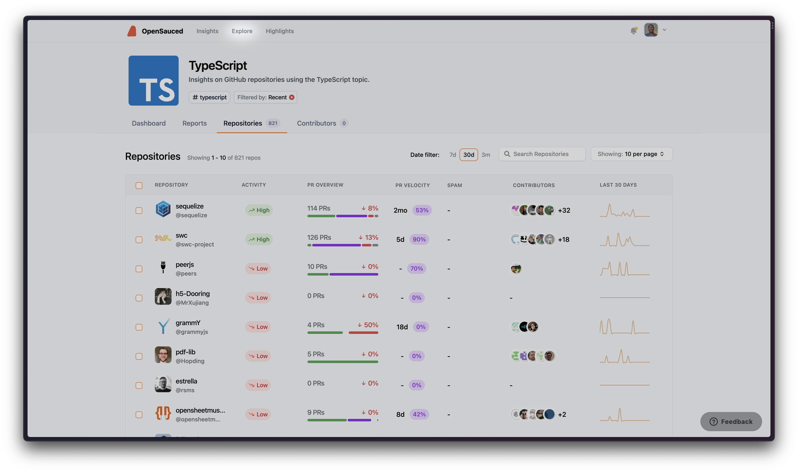
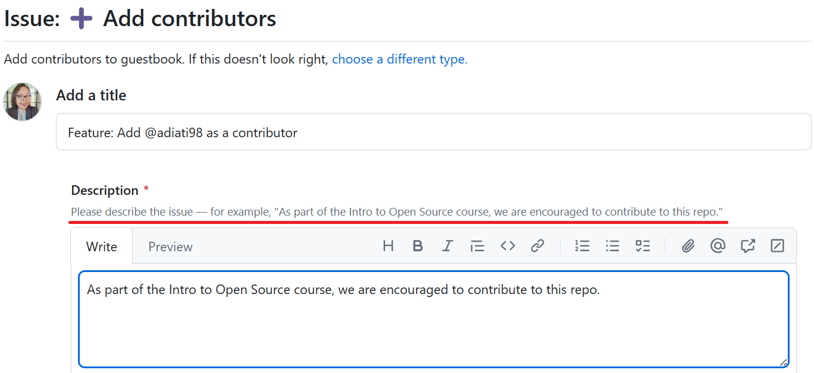
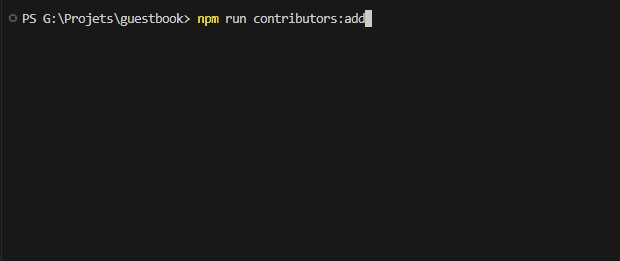
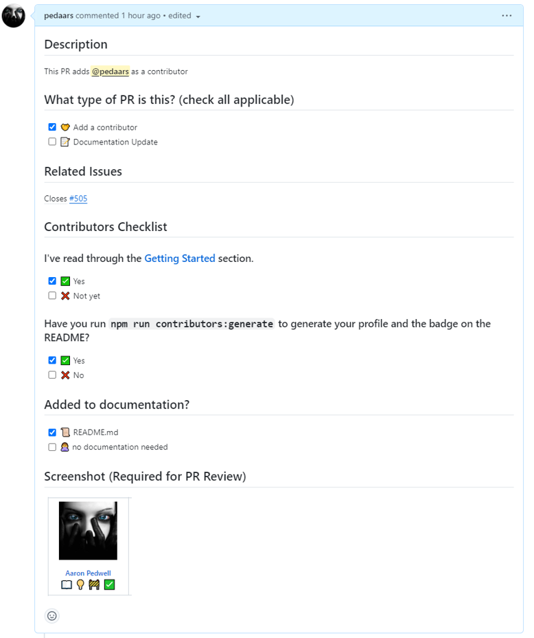

In this chapter, we will guide you through the process of contributing to open source.

## Finding Projects to Work On

One of the first challenges you might face when learning how to contribute to open source is finding a project to contribute to. Here are some tips to help you discover projects that align with your interests and skills:

1. **Browse GitHub and GitLab**: Both GitHub and GitLab host a vast number of open source projects. Use their search functionality to find projects based on specific keywords, programming languages, or topics.

2. **Follow your interests**: Think about the tools, frameworks, and libraries you use or are interested in learning more about. Many of these projects are open source and welcome contributions from the community.

3. **Join open source communities**: Numerous online communities, forums, and chat platforms are dedicated to open source development. By joining these communities, you can connect with other developers, discover new projects, and find collaboration opportunities. For example, in the [Community](https://github.com/orgs/open-sauced/discussions), we share good first issues, cool GitHub projects, and open issues in our repositories.

4. **Leverage OpenSauced**: [OpenSauced](https://opensauced.pizza/) is a platform that helps developers discover and contribute to open source projects. Using OpenSauced, you can find projects that align with your interests, skills, and goals.

:::tip
To effectively contribute to open source, start by familiarizing yourself with the project’s guidelines and community standards.
:::

### Discovering Open Source with OpenSauced

OpenSauced is a powerful tool for finding open source projects to contribute to. To get started with OpenSauced, follow these steps:

1. **Sign up for an account**: Visit [OpenSauced](https://www.opensauced.pizza/) and sign up using your GitHub credentials.

   

   During the signup process, you will be asked to pick some interests and set your timezone. This helps OpenSauced recommend projects that align with your interests and schedule.

2. **Explore the dashboard**: Once signed up, navigate to your dashboard to view your current projects, goals, and contributions. Clicking "Explore" in the header will take you to the Explore dashboard, where you can browse projects based on your interests and skills.

3. **Search for projects**: In the Explore dashboard, you can view a list of repositories with their activity and engagement levels. Use the search bar to find projects by name, description, or topic.

   

4. **Save projects to your Insights pages**: When you find projects of interest, add them to your "Insights" pages for detailed activity tracking. Alternatively, dive straight into contributing.

5. **Start contributing**: Clicking on a repository name will take you to its GitHub page, where you can explore open issues ready for contribution. Active communities welcome your contributions.

Contributing to open source involves more than just coding. It includes participating in discussions, reporting bugs, and improving documentation. OpenSauced streamlines the process of finding projects that align with your interests and goals.

## Onboarding in a New Project

When contributing to a new open source project, it is essential to familiarize yourself with the project’s guidelines, conventions, and workflow. Here are some tips to onboard successfully:

1. **Read the project’s documentation**: Review the README file, contributing guidelines, and code of conduct to understand the project’s goals, requirements, and expectations for contributors.

2. **Start small**: Begin with manageable tasks, such as fixing bugs, adding tests, or updating documentation. This helps you get familiar with the codebase and workflow without feeling overwhelmed.

3. **Join the open source community**: Many projects have online communities, forums, or chat platforms where developers can ask questions, share knowledge, and collaborate. Connecting with other contributors can help you learn and get support.

4. **Ask for help**: If you need clarification or encounter a problem, don’t hesitate to ask for help. Open source communities are generally supportive and welcoming.

5. **Be patient and persistent**: Onboarding can be challenging, especially if you are new to open source. Stay patient and don’t be discouraged by setbacks. With practice, you will gain confidence in your contributions.

## Getting Started With Contributing

Once you have onboarded yourself to a project, follow these steps to prepare for contributing:

### 1. Read the Documentation

We briefly touched on this earlier, but it is worth revisiting. Thoroughly read the project’s documentation before contributing. Start with the README to understand the project’s purpose, tech stack, and setup instructions.

Next, review the contributing guidelines, often found in a CONTRIBUTING file or the README. These guidelines outline how to claim issues, create pull requests, and communicate effectively. For example, check out the [OpenSauced Contributing Guidelines](https://opensauced.pizza/docs/contributing/introduction-to-contributing/).

Some projects also have conventions for code style, commit messages, and pull request titles. These may be detailed in a style guide or contributing guidelines.

:::tip
Carefully read the contributing guidelines to ensure a smooth contribution process.
:::

### 2. Find or Create an Issue

After reading the documentation, look for issues labeled "good first issue" or "beginner-friendly" that match your skill level. Consider your interests, skills, and available time when choosing an issue.

If you want to propose a bug fix, feature, or improvement, create an issue to outline your intention. Read [this blog post](https://dev.to/opensauced/streamline-your-contributions-mastering-issue-forms-and-pr-templates-36j5) to learn how to fill out issue forms.

Accompanying a pull request with an issue is crucial for several reasons:

- **Context and Discussion**: Discussing your proposal with maintainers ensures alignment with the project’s goals.
- **Documentation and Tracking**: Issues provide a historical record of the problem, solution, and decision-making process.
- **Reducing Back-and-Forth Communication**: Agreeing on changes beforehand saves time during pull request reviews.
- **Avoiding Unnecessary Work**: Early feedback helps you avoid working on changes that may not be accepted.
- **Preventing Spam Pull Requests**: Unsolicited pull requests may be marked as spam, leading to rejection.

### 3. Ask to be Assigned to an Issue

Some projects require you to ask for permission before working on an issue. If the contributing guidelines do not specify how to claim an issue, leave a comment like, "Can I please be assigned to this issue?" Once assigned, your username will appear under the "Assignees" section.


## Contribution Workflow

Once a maintainer has assigned you an issue, the next step is to work on the changes. Here's a general workflow of the process:

### 1. Fork the Repository

[Forking a repository](https://docs.github.com/en/get-started/quickstart/fork-a-repo#forking-a-repository) means creating a copy of the repository under your GitHub account. It allows you to push changes to the remote codebase without affecting the original project.

### 2. Clone the Forked Repository

[Cloning your forked repository](https://docs.github.com/en/repositories/creating-and-managing-repositories/cloning-a-repository#cloning-a-repository) means making a copy of your forked repository to your local machine. Run the following command in your terminal:

```bash
git clone https://github.com/YOUR-USERNAME/REPOSITORY-NAME.git
```

Replace "YOUR-USERNAME" with your GitHub username and "REPOSITORY-NAME" with the repository's name.

### 3. Create a New Branch

Before making any changes, create a new branch in your local repository to work on your contribution. Creating a new branch is the best practice in open source because it keeps your changes separate from the `main` branch.

You can create a new branch using the following command:

```bash
git checkout -b YOUR-BRANCH-NAME
```

Replace "YOUR-BRANCH-NAME" with a descriptive name for your branch, such as "fix-bug-123" or "add-new-feature".

### 4. Make Changes

Now that you have a new branch, you can make changes to the codebase. Always follow the project's coding guidelines and conventions.

### 5. Run the Changes Locally

You should always run and check your changes in your local environment, regardless of how small they are. This is important to ensure they work as expected and won't break production.

You can find the instructions on how to run a project locally in the README file or in the contributing guidelines.

### 6. Add and Commit the Changes

Once you've made your changes, add your changes to the staging area and commit them with these commands:

```bash
git add .
git commit -m "Your commit message"
```

Replace `"Your commit message"` with a brief description of your changes.

### 7. Push the Changes

Push your changes to your forked repository on GitHub by running the following command:

```bash
git push origin YOUR-BRANCH-NAME
```

Replace "YOUR-BRANCH-NAME" with the name of your branch.

### 8. Working with a Pull Request

#### Create a Pull Request

Once you've pushed your changes, you can now [create a pull request](https://docs.github.com/en/pull-requests/collaborating-with-pull-requests/proposing-changes-to-your-work-with-pull-requests/creating-a-pull-request-from-a-fork). To create a pull request:

1. Navigate to the original project's repository on GitHub.
2. Click the "Compare & pull request" button.
3. Fill in all required information in the template.
4. Click the "Create pull request" button.

#### Fill In a Pull Request Template

Most projects provided a pull request template that is shown and needs to be filled in Markdown. This template guides you in providing all the information maintainers need to review your pull request.

##### Tips to Fill In a Pull Request Template

It can be challenging to read and fill in a pull request template. Here is some tips on how to fill one:

1. **Preview Mode**

   Click the "Preview" tab to see the sections you must fill in before you do so. It will be easier for you to notice them in this mode, but note that you cannot edit them in preview mode.

   Here is an example of a pull request template at OpenSauced in preview mode:

   

2. **Headings**

   Get back to the writing mode by clicking the "Write" tab. Pay attention to the headings with `#` symbols. You need to provide information right under these headings.

3. **Comments**

   The instructions on what information you must provide are usually written in the comments under each heading. You need to read and follow all instructions thoroughly.

   :::tip

   When filling in the information, write it below the comment so you can still see and follow the instructions.

   :::

   Here is the template in Markdown. Now, pay attention to the headings and the comments as we discussed:

   ```markdown
   ## Description

   <!--
   Please do not leave this blank
   This PR [adds/removes/fixes/replaces] the [feature/bug/etc].
   -->

   ## Related Tickets & Documents

   <!--
   Please use this format link issue numbers: Fixes #123
   https://docs.github.com/en/free-pro-team@latest/github/managing-your-work-on-github/linking-a-pull-request-to-an-issue#linking-a-pull-request-to-an-issue-using-a-keyword
   -->

   ## Mobile & Desktop Screenshots/Recordings

   <!-- Visual changes require screenshots -->

   ## Steps to QA

   <!--
   Please provide some steps for the reviewer to test your change. If   you have wrote tests, you can mention that here instead.

   1. Click a link
   2. Do this thing
   3. Validate you see the thing working
   -->

   ## Tier (staff will fill in)

   - [ ] Tier 1
   - [ ] Tier 2
   - [ ] Tier 3
   - [ ] Tier 4

   ## [optional] What gif best describes this PR or how it makes you feel?

   <!-- note: PRs with deleted sections will be marked invalid -->

   <!--
   For Work In Progress Pull Requests, please use the Draft PR feature,
   see https://github.blog/2019-02-14-introducing-draft-pull-requests/ for further details.

     For a timely review/response, please avoid force-pushing additional
     commits if your PR already received reviews or comments.

     Before submitting a Pull Request, please ensure you've done the following:
     - 📖 Read the Open Sauced Contributing Guide: https://github.com/open-sauced/.github/blob/main/CONTRIBUTING.md.
     - 📖 Read the Open Sauced Code of Conduct: https://github.com/open-sauced/.github/blob/main/CODE_OF_CONDUCT.md.
     - 👷‍♀️ Create small PRs. In most cases, this will be possible.
     - ✅ Provide tests for your changes.
     - 📝 Use descriptive commit messages.
     - 📗 Update any related documentation and include any relevant screenshots.
   -->
   ```

4. **Don't skip and delete anything in the template**

   What's important is that you must fill in every section in the template that doesn't say "optional" or doesn't mean for the core team or staff to fill in. Also, you must never delete or modify the template, even if you think a section doesn't apply to your contribution.

   If a section is irrelevant to your changes, leave a comment explaining why it's irrelevant or provide a brief "N/A" response. If you still need help with what to fill in, look at the previous pull requests and see how other contributors have done that.

##### Required Information to Provide in Most Pull Request Templates

Every project is unique. Each has its own pull request template structure and requires specific information to be provided. However, all projects typically require the following:

- **Title**

  Add a short and clear title that describes the change that you make. For example, "Fix: Color contrast in the landing page".

- **Description**

  Explain your changes in as much detail as possible. What did you fix? How did you fix it? Did you add a new function or modify a function? If there are several changes, consider using bullet points and providing links to the resources you use to back up your changes.

  Here is an example:

  ```markdown
  ## Description

  <!--
   Please do not leave this blank
   This PR [adds/removes/fixes/replaces] the [feature/bug/etc].
   -->

  This PR fixes the long repos' names that are partially stacked at the back of another name in the search input of the Explore tab.

  The changes made here:

  - Add Tailwind className:

    - [`truncate`](https://tailwindcss.com/docs/text-overflow#truncate) to truncate overflowing text.
    - [`tracking-tighter`](https://tailwindcss.com/docs/letter-spacing) to reduce letter spacing for better space.
    - `inline-block` to the `<span>` .

  - Remove Tailwind classNames:

    - `overflow-hidden` as it's [included in the `truncate`](https://tailwindcss.com/docs/text-overflow).
    - `break-all` as we don't want to add line breaks.
  ```

- **Related issue(s)**

  Most projects don't receive unsolicited pull requests (pull requests that are not accompanied by an issue). One reason is to avoid spam pull requests that might introduce irrelevant, low-quality, or harmful changes to the project's codebase.

  So, when you create a pull request, you want to include the related issue number. Add the keyword "Closes," "Fixes," or "Resolves" in front of the issue number, for example, "Closes #123".

  [Linking a pull request](https://docs.github.com/en/issues/tracking-your-work-with-issues/linking-a-pull-request-to-an-issue) to an issue will automatically close the issue once the pull request gets merged.

  You can find the issue number right after the title, as shown below.

  

  :::info

  Only add the [supported keyword](https://docs.github.com/en/free-pro-team@latest/github/managing-your-work-on-github/linking-a-pull-request-to-an-issue#linking-a-pull-request-to-an-issue-using-a-keyword) and the issue number here. Adding more words will prevent the issue from being closed automatically.

  :::

- **Screenshots or screen recordings**

  If your changes relate to UI improvement, consider adding screenshots or screen recordings to show the before-and-after changes.

### 9. Respond to Feedback

After submitting your pull request, the project maintainers may provide feedback or request changes. Be sure to respond promptly and address any concerns or suggestions they may have.

By following these steps, you'll be able to submit your contributions to open source projects and collaborate with other developers to improve the codebase.

## What Happens Next?

After your contribution has been submitted and reviewed, one of the following outcomes may occur:

1. **Your contribution is accepted**: If your contribution is approved by the project maintainers, it will be merged into the main branch of the codebase. <br/>
   Congratulations! Your work is now part of the project, and you've made a valuable contribution to the open source community.

2. **Your contribution requires changes**: Sometimes, the project maintainers may request changes to your contribution before it can be accepted. This could be due to coding issues, conflicts with other changes, or a need for additional documentation. In this case, make the requested changes and resubmit your pull request.

3. **Your contribution is rejected**: In some cases, your contribution may not align with the project's goals or requirements, or it may not be the best solution to a problem. If your contribution is rejected, don't be discouraged. Take the feedback you received as an opportunity to learn and improve. You can always try contributing to another project or submitting a different contribution to the same project.

## Let's Get Practical

Now that you know how to find and contribute to open source projects, it's time to put your skills into practice. Let's do this by contributing to OpenSauced's [guestbook repository](https://github.com/open-sauced/guestbook).

### Prerequisite

You'll need to have these tools donwloaded and installed on your local machine:

- [Node.js](https://nodejs.org)
- [Visual Studio Code (VS Code)](https://code.visualstudio.com/)

### Getting Started

1. Create an issue by following these instructions:

   - Click the "Issues" tab on the top bar.
   - Click the green "New issue" button at the top right.
   - Click the "Get started" button to add contributors.
   - Add a title, e.g., `Feature: Add @GITHUB-USERNAME as a contributor`. <br/> Change "@GITHUB-USERNAME" to your GitHub username.
   - Complete the form. Read the instructions under each input label and fill in the textareas using the example shown in the screenshot below with the red line.

     

   - Click the "Submit new issue" button.

2. Fork the [guestbook repository](https://github.com/open-sauced/guestbook).
3. Clone your forked repository to your computer.
4. Run `npm install` to install the dependencies.
5. Create a new branch and use a descriptive name related to your contribution — for example, `feat/add-alice`.
6. Run `npm run contributors:add` in your terminal.

   Follow the instructions to add yourself to the guestbook. After you finish and click enter, you must click enter again to confirm your choices.

   

7. Run `npm run contributors:generate` in your terminal to generate the guestbook on the README.
8. Copy and paste the Markdown of the README in [Markdown Live Preview](https://markdownlivepreview.com/) and take a screenshot of your profile being generated as the example below. You will need this later when creating a pull request.

   

   :::tip

   If you don't see your profile in the "Contributors" section, zoom out the screen until you can see it before taking a screenshot.

   :::

9. Run `git log` to check if your changes have been automatically committed. To close the log, press `Q`.

   Here's what you should expect to see as your commit message:

   ```bash
   docs: add @your_username as a contributor
   ```

10. Push the commit to your forked repository with this command:

    ```bash
    git push -u origin branch-name
    ```

11. Go to your forked repository on GitHub. Create a pull request with the title `feat: Add <@github-username> as a contributor` and fill in all areas in the pull request template. Read the [Fill In a Pull Request Template](#fill-in-a-pull-request-template) section to help you complete the template.

    :::warning

    Your pull request will be marked as invalid and may be closed if the template is incomplete.

    :::

### Completed PR Template

Here's what a completed Pull Request Template for the guestbook looks like. Make sure yours looks like this, updated with your unique information.



Congratulations on your first contribution! 🎉

:::tip

If you're ready for your next contribution, check out the [pizza-verse repository](https://github.com/open-sauced/pizza-verse) and follow the contribution guidelines.

:::

## Keeping Branches Up to Date

It is highly recommended that you update your remote and local branches habitually. That way, your branch will have the latest update when merged into the `main` branch of the original (`upstream`) repository.

The best times to update your branches are before you push your changes to the remote repository and while you're waiting for your pull request to be reviewed.

### Updating Branches

First, you must update your forked (`origin`) repository:

1. Go to your forked repository on GitHub.
2. Click the "Sync fork" button.
3. Click the green "Update branch" button.

Then, pull the latest changes in the `main` branch in the `origin` repository to update your local working branch by following these steps in your terminal:

1. Go to your working branch.

   ```bash
   git checkout YOUR-BRANCH-NAME
   ```

2. Pull the latest changes with this command:

   ```bash
   git pull origin main
   ```

## Merge Conflicts

Merge conflicts are something you'll commonly encounter when contributing to an open source project. When two branches have made different changes to the same line(s) in the same file(s), Git cannot automatically determine which change to keep, resulting in a conflict.

When a merge conflict occurs, Git adds conflict markers (`<<<<<<<`, `=======`, and `>>>>>>`) to indicate the conflicting lines from different branches. Everything between the `<<<<<<<` and `=======` is the changes that you worked on (current changes). And everything between the `=======` to `>>>>>>>` is the incoming changes from the remote `main` branch.

You need to pay attention to the conflicts and decide how you want to resolve them. You can keep only your change, incoming change, or both changes.

### Tips to Prevent Resolving Merge Conflicts Repeatedly

Some open source repositories, such as OpenSauced's [guestbook](https://github.com/open-sauced/guestbook) and [pizza-verse](https://github.com/open-sauced/pizza-verse) repositories, have high contribution activities in the same files that can cause merge conflicts.

Below are some tips to prevent you from resolving merge conflicts repeatedly when contributing to open source projects:

#### 1. Following Instructions

Ensure you follow the instructions in the project's README or Contributing Guide, and don't miss any step.

#### 2. Pull Request Form

Complete the template form and fill in all areas when creating a pull request.

If a repository doesn't provide you with a pull request template, you need to have these in your pull request form:

- **A descriptive title**: A descriptive title would help maintainers and other contributors gain an idea of what your contribution is. <br/>
  Consider using the following method to write your title: `type: brief description of your contribution`. For example, `fix: color contrast issue on the navbar`, `feat: create a warning button`, etc.

- **A clear description of your pull request**: Describe your pull request clearly. Consider explaining your changes, thoughts behind the solution, etc. A clear description gives maintainers and other contributors insight into the details of your changes. Here is [an example of a clear description in a pull request](https://github.com/open-sauced/intro/pull/10).

- **The [link to the related issue](https://docs.github.com/en/issues/tracking-your-work-with-issues/linking-a-pull-request-to-an-issue)**: Linking a pull request to the addressed issue will close the linked issue automatically when the pull request gets merged. This makes it easier for maintainers to keep their projects organized.

- **A screenshot or screen recording when you make a UI change**: Providing screenshots or screen recordings will make it easier for maintenance to visualize your changes and review your pull request.

#### 3. Resolving Merge Conflicts Immediately

If a branch has merge conflicts that must be resolved, the merge button is automatically disabled. So, maintainers are not able to merge the pull request.

When you notice merge conflicts in your pull request or if a maintainer asks you to resolve merge conflicts, fix them immediately. The sooner you resolve the conflicts, the sooner maintainers can review and merge your pull request.

### Merge Conflicts in the Guestbook Repository

Since the primary purpose of the guestbook is to add your name to `.all-contributorsrc` and the `README.md` files, there is a high chance that you will encounter merge conflicts.

The conflicts happen when maintainers have merged pull requests before yours while you're working on your changes or waiting for your pull request to be reviewed. And you need to resolve them before your pull request can be merged.

#### Resolving Merge Conflicts

Before resolving merge conflicts, you must first [update your branches](#updating-branches). Then, follow these steps:

1. In the `.all-contributorsrc` file:

   - Click the "Accept Both Change" option on the top of your workspace in VS Code.
   - Move your profile details to the end of the contributors' array and fix anything necessary.

2. In the `README.md` file:

   - Click the "Accept Incoming Change" option on the top of your workspace in VS Code for each conflict in this file.

3. Run `npm run contributors:generate`.

   You will now see that the all contributors badge has been incremented, and your profile is generated at the end of the contributors' list in the `README.md` file.

4. Add and commit your changes.

   ```bash
   git commit -am "Resolve merge conflicts"
   ```

5. Push your commits to your remote branch.

   ```bash
   git push
   ```

<hr/>

As you continue to contribute to open source projects, you'll gain valuable experience, develop new skills, and build a strong portfolio of work. In the [next chapter](the-secret-sauce.md), we'll discuss some strategies for getting started with open source contributions, gaining traction in your contributions, and developing your open source resume using OpenSauced.
