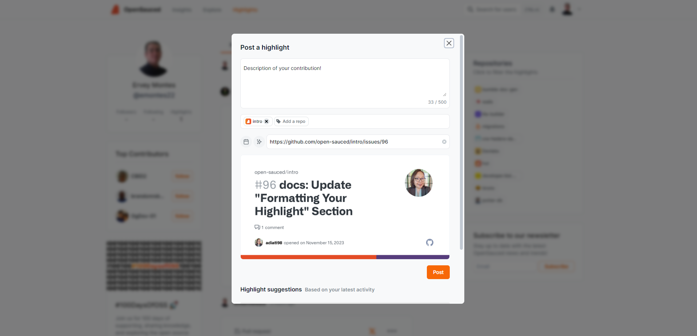

In this chapter, we'll share some lesser-known strategies and tips for making a lasting impact in the open source community. We'll discuss how to focus on open issues, gain traction with your contributions, and build your open source resume using OpenSauced.

## Open Issues — More than PRs that Fix Typos

While fixing typos and improving documentation are valuable contributions to open source projects, it's important to look beyond these low-hanging fruits and focus on addressing open issues. Tackling open issues not only helps the project progress but also allows you to develop a deeper understanding of the codebase and showcase your problem-solving abilities.

Here are some tips for finding and addressing open issues:

1. **Browse the issue tracker**: Most open source projects use an issue tracker to manage bugs, feature requests, and other tasks. Look for issues that align with your interests and skills.

2. **Look for beginner-friendly issues**: Many projects use labels like "good first issue" or "help wanted" to indicate issues suitable for newcomers. Start with these to build confidence and gain experience before tackling more complex tasks.

3. **Understand the issue**: Before diving in, make sure you understand the problem and the desired outcome. If you're unsure, ask questions or seek clarification from the maintainers or other contributors.

4. **Communicate your intentions**: Before you start working on an issue, let the maintainers and other contributors know you're interested in addressing it. This helps avoid duplicated efforts and ensures everyone is on the same page.

5. **Test your changes**: After addressing an issue, test your changes thoroughly to ensure they work as expected and don't introduce new problems.

By focusing on open issues rather than just fixing typos, you'll make a more significant impact on the projects you contribute to and show your commitment to the open source community.

## Getting Traction in Contributions

As you gain experience in open source, you may want to increase your impact and gain recognition for your efforts. Here are some strategies for gaining traction with your contributions:

1. **Become a regular contributor**: Consistently contribute to the same projects over time. This helps you develop a deeper understanding of the codebase, build relationships, and establish yourself as a valuable community member.

2. **Take on challenging tasks**: As you gain experience, tackle more complex issues and features. This helps you grow as a developer and demonstrates your ability to handle challenging work and contribute meaningfully.

3. **Collaborate with others**: Open source is all about collaboration. Work with other contributors to address issues, develop features, and share knowledge. Effective collaboration not only improves the project but also helps you build a strong network in the open source community.

4. **Share your expertise**: Share your knowledge by writing blog posts, creating tutorials, or giving presentations about the projects you work on. This helps others learn from your experiences and establishes you as a thought leader in the open source community.

5. **Mentor new contributors**: As you become more experienced, consider mentoring newcomers who are just starting their open source journey. This helps you give back, develop leadership skills, and build a positive reputation.

## Building Your Open Source Resume

Building a strong open source resume helps you showcase your skills, experience, and contributions to potential employers, collaborators, and the wider developer community. OpenSauced is an excellent tool for tracking your open source contributions and developing your open source resume. Here's how you can use OpenSauced to support your open source journey:

1. **Sign up for an OpenSauced account**: If you haven't already, visit [opensauced.pizza](https://opensauced.pizza/) and sign up using your GitHub credentials.

2. **Visit your public profile page**: After signing up, a public profile page will be created for you. This page displays your GitHub profile information and a list of your open source contributions. You can access it by clicking your username in the top right corner.

   

3. **Build your open source resume**: Here, you can add highlights to pull requests and issues you've contributed to. You can also add descriptions and links to your open source resume. These will be aggregated into a single page you can share, along with a summary of your contributions displayed on your public profile.

Let's showcase our guestbook contribution from the previous chapter! In your profile, you'll see a "Highlights" section with a text input. When you click this, you can add a title, some thoughts, and a link to your PR. This will be displayed on your public profile page. Let's add a highlight for our guestbook contribution.

### Effectively Highlight Your Contributions

Important information to include when highlighting your contributions:

- New material you've created
- Project details (tools, libraries, size, and complexity)
- The type of your contributions: bug fix, feature, performance, documentation, etc.
- Details of your contribution, including improvements and impacts made on the project and community
- Collaboration and teamwork details

### Formatting Your Highlight

To highlight your contributions most effectively, we recommend using the following format:

- **Description**: Mention the impact your contribution had on the overall project. This is especially helpful for job applications, particularly if you have employment gaps. Consider using this model to craft your highlight as a story:
  - Success verb + noun + metric + outcome.
  - Example: While reviewing pull requests for GirlScript Summer of Code, I noticed most would not merge despite approvals. So, I **created a GitHub Action where pull requests automatically merge once they pass deployment steps (success verb + noun)**, which **increased productivity rates by 80% (metric + outcome).**
- **Add a repo**: Provide the full name of the repository you contributed to.
- **URL**: Paste the URL to your pull request, issue, or blog post.

  

- **Share it!**: Once you've built a portfolio of open source contributions, you can share your OpenSauced resume with others by clicking the share button in your profile header. This is especially helpful when applying for jobs, networking, or promoting your work in the open source community.

By leveraging OpenSauced to track your open source contributions and develop your resume, you'll be better equipped to showcase your skills, experience, and impact. Additionally, you can refer to the [Job Seekers Guide](https://opensauced.pizza/docs/opensauced-guides/job-seekers-guide/job-seekers-guide-introduction/) in our docs to learn how to use OpenSauced to land a job in tech.

In conclusion, making a lasting impact in open source requires a combination of technical skills, collaboration, and persistence. By focusing on open issues, gaining traction with your contributions, and leveraging tools like OpenSauced, you'll be well on your way to a successful and fulfilling open source journey.

In the [next chapter](types-of-contributions.md), we'll discuss various types of open source contributions.
